# Laravel-8
Repositorio dedicado a prácticas de Laravel 8 para aprender

Requisitos para instalar laravel 8 en Windows

- Disponer de MovaXterm
- Disponer de VSCODE
- Disponer de Laragon

Instalación de Composer

Comprobamos que no tenemos instalado composer en nuestro equipo con el siguiente comando

> composer

Si no lo tenemos instalado, iremos a la siguiente direccion

> https://getcomposer.org/download/

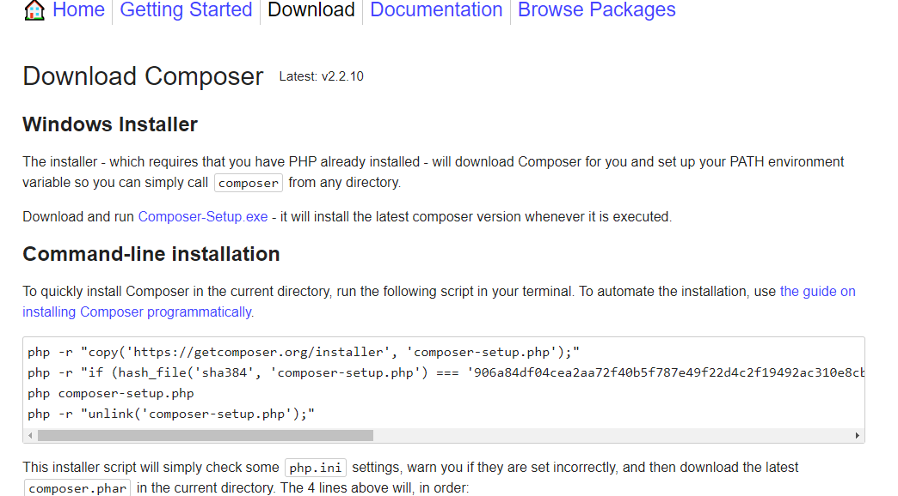

Luego nos descargaremos composer clickando en el siguiente enlace

Procedemos a instalar composer desde el setup, nos aparecerá la siguiente ventana en la cual seleccionamos la primera opcion

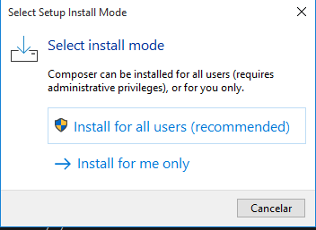

Seguidamente en la siguiente ventana no seleccionamos nada, solo continuamos

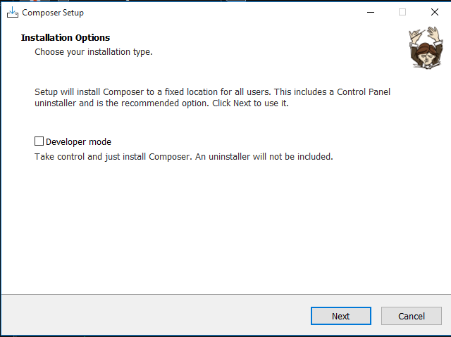

En la siguiente ventana tenemos que especificar la ruta donde tenemos el archivo ejecutable de php dentro de laragon en mi caso seria la de la siguiente imagen

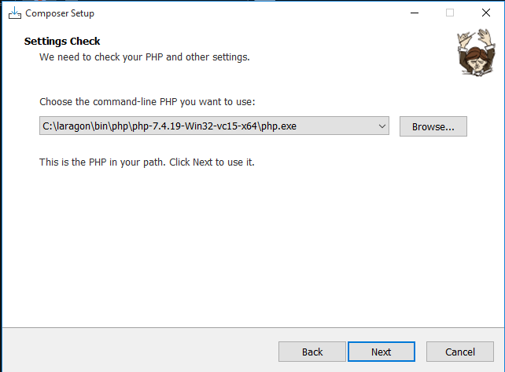

En la proxima ventana no seleccionamos nada y continuamos con la instalacion

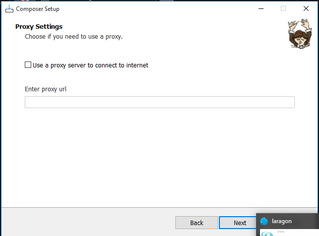

Clickamos en install, tardara un poco en instalarse.

Para comprobar si tenemos composer instalado iremos a moba y introducimos el comando

> Composer

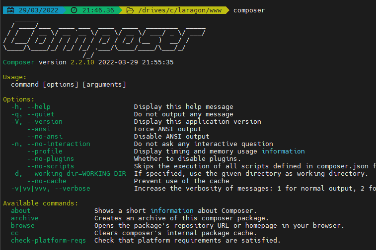

Ahora procederemos a instalar laravel, nos ponemos en siguiente ruta e introducimos el comando que aparece en la imagen

> composer config -g repo.packagist composer https://mirrors.aliyun.com/composer/

 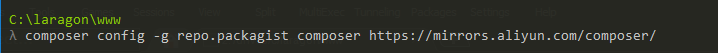

 Seguidamente introducimos el siguiente comando que instalará laravel

 > composer create-project --prefer-dist laravel/laravel prueba 8.0

 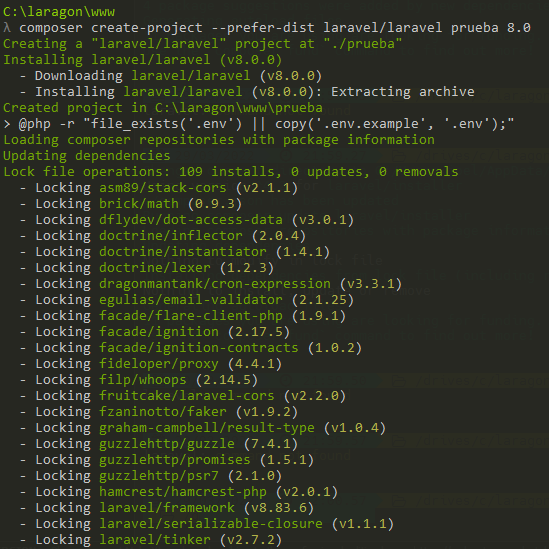

 Nos aseguramos que se a instalado con el comando

 > Laravel

 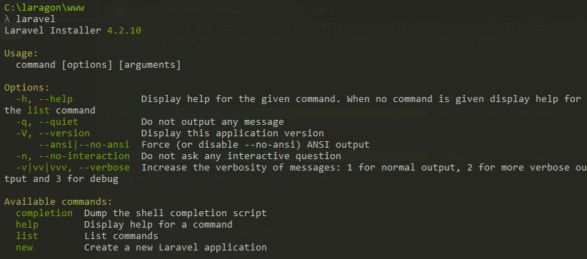

 Para crear un proyecto nuevo introducimos *laravel new* como en el ejemplo siguiente

 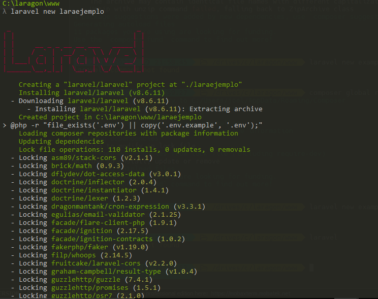

 Seguidamente tendremos los proyectos creados en la carpeta

 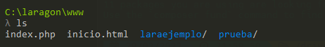

 Reiniciamos el servicio apache de laragon

 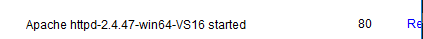

 En el navegador introducimos el nombre del proyecto seguido de .test para ver la pagina principal en mi caso seria asi

 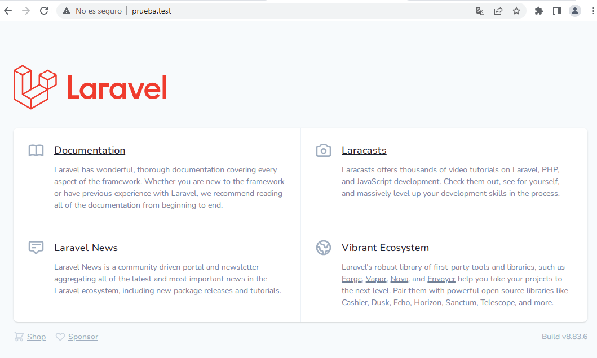
